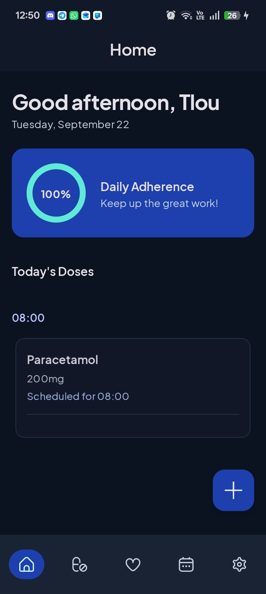
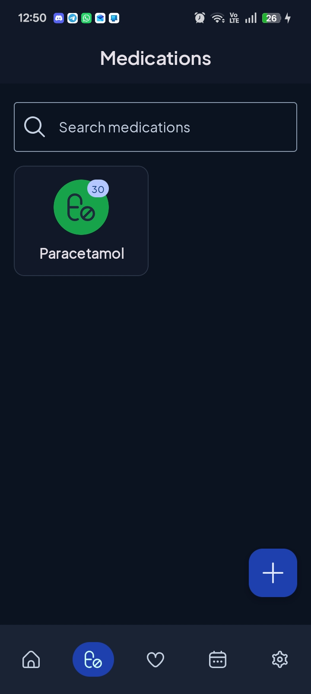
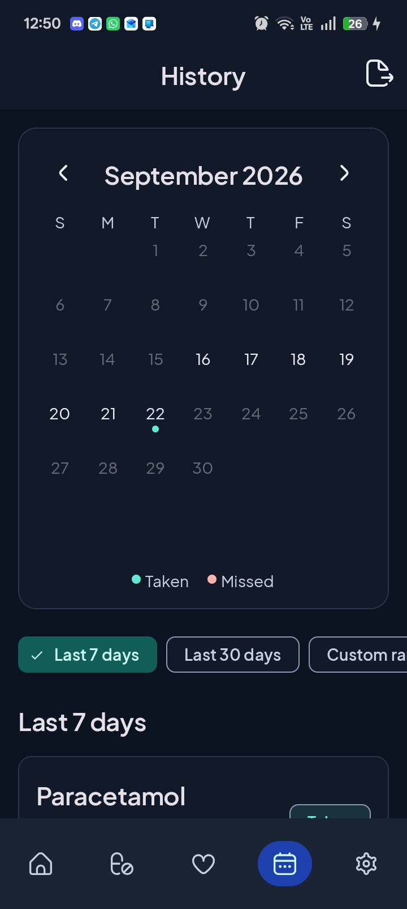
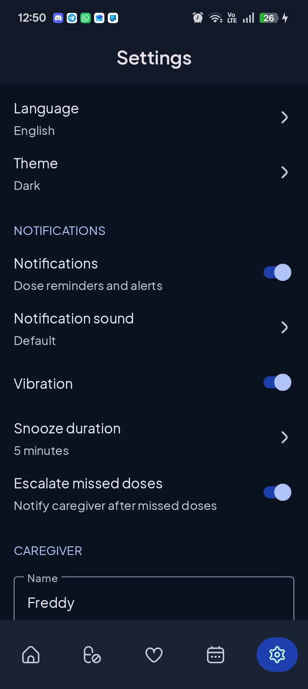
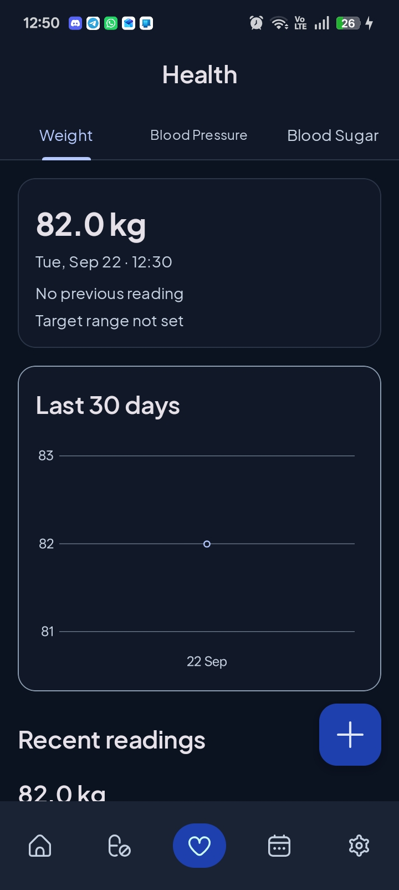
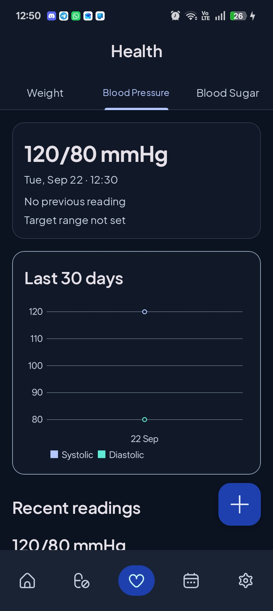
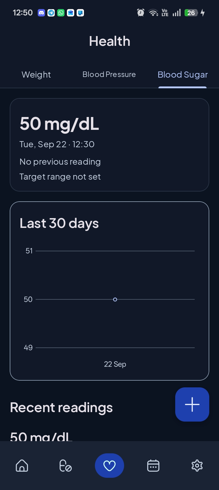

# MediCheck Reminder

MediCheck Reminder is an Android app that helps a person take medication on schedule. They add each medication, receive a reminder at the scheduled time, and mark the dose taken, skipped, or snoozed. History shows those outcomes for the last 7 days, the last 30 days, or a custom range. The same app records weight, blood pressure, and blood sugar. The interface is available in English, isiZulu, and Afrikaans.

A walkthrough of the app is in this demonstration: [MediCheck Reminder demo](https://youtu.be/Chz8wPsceyg).

## Students

- ST10177726 - Tlou Pheme
- ST10286000 - Ayanda Rikhotso
- ST10384687 - Angel Kgafela
- ST10451890 - Lerato Mojalefa
- ST10457083 - Hlompho Petja

## Screenshots

## Design considerations

Data stays on the phone. Room stores medications, dose logs, and health readings. The account, an email and a password hash, is kept in encrypted preferences. Reminders are scheduled on the device, so a dose alert does not depend on a network connection. A cloud copy is only worth adding later if the record must move to another phone, or if a caregiver should be notified without anyone opening Messages or email.

History begins on the day a medication is added. Earlier days are left empty, because the person was not using the app yet and those doses were not missed.

Reminders use `AlarmManager`. The notification offers Taken and Snooze. Snooze uses the duration chosen in Settings. When missed-dose escalation is on, a follow-up notification can open a message or an email to the caregiver saved in Settings. Alarms are rebuilt when medications or reminder settings change, and again after the phone restarts. On Android 12 and later, exact delivery needs the system Alarms and reminders permission. Without it, the alert can arrive a little later.

The interface follows Material 3, with Plus Jakarta Sans, and draws edge to edge so text stays clear of the camera cutout and the system navigation bar. Icons are Uicons by Flaticon, credited on the Settings screen. Each medication keeps one pill color derived from its name, so the cabinet stays recognizable after the name is saved.

Language is applied with per-app locales (`en`, `zu`, and `af`). Screen titles, buttons, errors, and health labels come from string resources, so changing the language replaces the interface rather than a few words.

History can export the doses in the selected period as a PDF and hand that file to the system share sheet.

## GitHub

Source is hosted at [github.com/TlouPheme/medicheck-reminder](https://github.com/TlouPheme/medicheck-reminder). `main` is the branch that holds the shared history. Changes are proposed with a pull request so they can be reviewed before they land on `main`.

## GitHub Actions

`[.github/workflows/android.yml](.github/workflows/android.yml)` runs on every push to `main` and on every pull request that targets `main`. The job checks out the repository, sets up Temurin JDK 21, accepts the Android SDK licenses on the runner, installs the API 37 platform, and runs `./gradlew :app:assembleDebug`. A successful run means the debug app compiled on a clean machine. The result is reported on the commit and on the pull request.